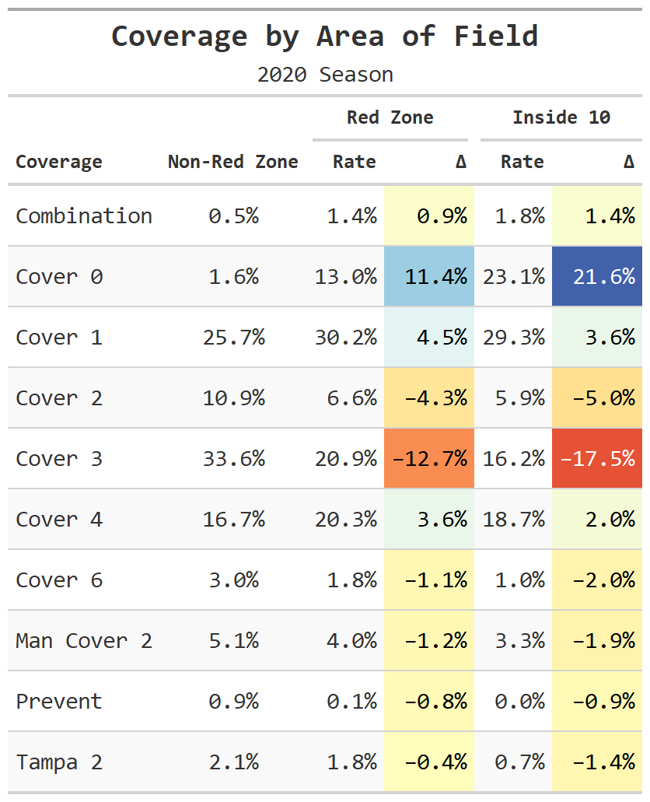
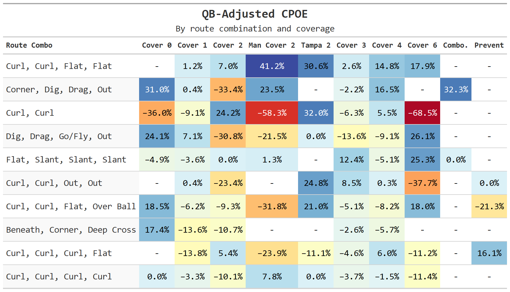
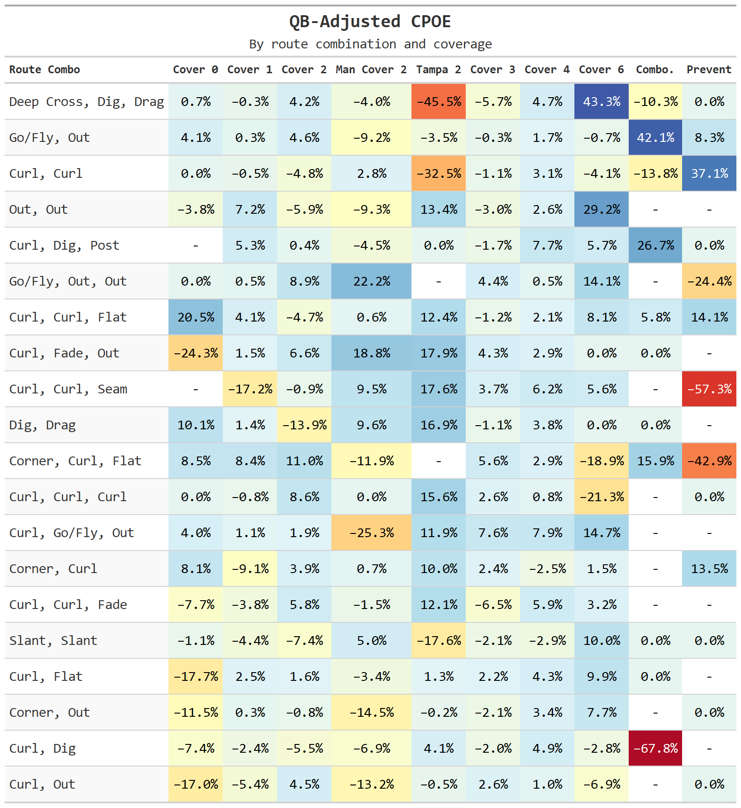

```{r setup, include=FALSE}
knitr::opts_chunk$set(echo = FALSE, warning = FALSE, message = FALSE)
library(formattable)
library(tidyverse)
library(paletteer)
library(prismatic)
library(nflfastR)

library(gt)

`%!in%` = Negate(`%in%`)

# Load data files
gameinfo <- read.csv("Data/GameInfo.csv")
pbp <- read.csv("Data/PlayByPlay.csv")
playertotalpts <- read.csv("Data/PlayerTotalPoints.csv")
skillpositionplyrs <- read.csv("Data/SkillPositionPlayers.csv")

# Change names for ease of manipulation
names(skillpositionplyrs)[names(skillpositionplyrs) == "OnFieldPosition"] <- "OFP"
names(skillpositionplyrs)[names(skillpositionplyrs) == "RosterPosition"] <- "RosPos"

# Get team abbreviations from nflfastR
team_names <- nflfastR::teams_colors_logos %>% select(team_abbr, team_name, team_nick) %>% 
  filter(team_abbr %!in% c("SD", "LAR", "OAK", "STL")) # Get rid of old team names

# Create custom theme using Owen Phillips' template
theme_owen <- function () { 
  theme_minimal(base_size=11) %+replace% 
    theme(
      panel.grid.minor = element_blank(),
      plot.background = element_rect(fill = 'white', color = "white")
    )
}

# Create gameid master table for joining pbp to nflfastR pbp
gameids <- gameinfo %>% 
  select(GameId, Season, Week, HomeTeam, AwayTeam) %>% 
  left_join(team_names, by = c("HomeTeam" = "team_nick")) %>% # Offense abbr
  select(-team_name) %>% relocate(HomeTm = team_abbr, .after = HomeTeam) %>% 
  left_join(team_names, by = c("AwayTeam" = "team_nick")) %>% # Defense abbr
  select(-team_name) %>% relocate(AwayTm = team_abbr, .after = AwayTeam) %>% 
  mutate(nflfastRid = if_else(Week < 10,
                              paste(Season,"_", 0, Week, "_", AwayTm, "_", HomeTm, sep = ""),
                              paste(Season,"_", Week, "_", AwayTm, "_", HomeTm, sep = "")))
```

When writing about Sean McVay's offense for the [Undefeated](https://theundefeated.com/features/rams-coach-sean-mcvay-is-an-offensive-genius/), Dominique Foxworth said, "Genius is creativity and ingenuity. In football, it is exploiting an advantage that other teams have yet to find." And while the window dressing, motion, and play design of McVay's offenses have made his team lethal, it isn't as if he's invented a whole new route tree. In fact, Foxworth notes that the "core of their passing game" relies on "traditional route combinations." Football, then, isn't always about reinventing the wheel,^[Pun intended.] but finding which wheels work best to exploit each coverage, and using those tools to put your players into advantageous positions.

So which routes did teams call the most in 2020? And, more importantly, how effective were those routes against each defensive coverage?

```{r gameids, include=FALSE}
# Change names for ease of manipulation
names(skillpositionplyrs)[names(skillpositionplyrs) == "OnFieldPosition"] <- "OFP"
names(skillpositionplyrs)[names(skillpositionplyrs) == "RosterPosition"] <- "RosPos"

# Get team abbreviations from nflfastR
team_names <- nflfastR::teams_colors_logos %>% select(team_abbr, team_name, team_nick) %>% 
  filter(team_abbr %!in% c("SD", "LAR", "OAK", "STL")) # Get rid of old team names

# Create gameid master table for joining pbp to nflfastR pbp
gameids <- gameinfo %>% 
  select(GameId, Season, Week, HomeTeam, AwayTeam) %>% 
  left_join(team_names, by = c("HomeTeam" = "team_nick")) %>% # Offense abbr
  select(-team_name) %>% relocate(HomeTm = team_abbr, .after = HomeTeam) %>% 
  left_join(team_names, by = c("AwayTeam" = "team_nick")) %>% # Defense abbr
  select(-team_name) %>% relocate(AwayTm = team_abbr, .after = AwayTeam) %>% 
  mutate(nflfastRid = if_else(Week < 10,
                              paste(Season,"_", 0, Week, "_", AwayTm, "_", HomeTm, sep = ""),
                              paste(Season,"_", Week, "_", AwayTm, "_", HomeTm, sep = "")))
```


# Finding Route Combinations

First, let's take a holistic look at play calling to find which combinations of routes were called the most frequently. This will include tight ends, wide receivers, slot receivers, and backs split out wide, but will exclude backs coming out of the backfield. Backs are excluded for multiple reasons:

* When they aren't used as decoys, they tend to run flats and swing routes.
* Including back routes restricts the number of full route combinations, thereby limiting sample size.
* Passes to backs are lower value, and tend to be used as safety valves when not in the screen game.

```{r dropbacks, include=FALSE}
# Get pass plays----------------------------------------------------------------------------------
# Keep scrambles for now; use those as 0 EPA/CPOE
dropbacks <- nflfastR::load_pbp(2020) %>% 
  dplyr::filter(qb_dropback == 1, !str_detect(desc, "TWO-POINT CONVERSION"), # Filter out two-point conversions
                qb_spike == 0) # Select all dropbacks using nflfastr

roster_2020 <- nflfastR::fast_scraper_roster(2020) %>% 
  dplyr::select(position, gsis_id) # Pull roster data

dropbacks <- dropbacks %>%  # Filter out passes made by non-QBs as those are mostly trick plays
  dplyr::left_join(roster_2020, by = c("passer_id" = "gsis_id")) %>% 
  dplyr::filter(position == "QB") %>%
  unique() %>%
  dplyr::select(game_id, qtr, quarter_seconds_remaining, qb_dropback)

pass_plays <- gameids %>% # Use dropbacks to get pass plays in pbp set
  dplyr::select(GameID = GameId, nflfastRid) %>% 
  dplyr::left_join(pbp, by = c("GameID")) %>% 
  dplyr::left_join(dropbacks, by = c("nflfastRid" = "game_id", "Quarter" = "qtr",
                                     "TimeLeft" = "quarter_seconds_remaining"), suffix = c("_SIS", "_nflfastR")) %>% 
  dplyr::filter(qb_dropback == 1, CoverageScheme %!in% c("NULL", "Other", "Screen", "Spike")) %>% 
  # Get rid of screens/spikes/plays without coverages/unknown coverages
  dplyr::mutate(game_event = paste(GameID, EventID, sep = "_"))

# Filter skill position players table to get passing plays---------------------------------
pass_routes <- skillpositionplyrs %>% 
  mutate(game_event = paste(GameID, EventID, sep = "_")) %>% 
  mutate(Route = str_replace_all(Route, "Chip - ", "")) %>% # Rename chips
  mutate(Route = str_replace_all(Route, " - Left", "")) %>% # Rename directional routes
  mutate(Route = str_replace_all(Route, " - Right", "")) %>% 
  filter(game_event %in% pass_plays$game_event)

# Get pbp from nflfastR and select relevant columns------------------------------------------------
pbp_nflfastR <- load_pbp(2020) %>% 
  filter(qb_dropback == 1, !str_detect(desc, "TWO-POINT CONVERSION"),
         qb_spike == 0) %>%  # Use same filters as before 
  select(game_id, qtr, quarter_seconds_remaining,
         # Items to join by
         air_yards, pass_length, yards_after_catch,
         score_differential, goal_to_go, down,
         interception, qb_hit, sack, touchdown, pass_touchdown,
         penalty, penalty_team, penalty_yards, aborted_play, no_huddle,
         passer_player_name, # For determining QB quality
         # Play details
         surface, temp, wind,
         # Game environment
         epa, qb_epa, wpa, vegas_wpa, air_epa, air_wpa, yac_wpa,
         cp, cpoe, success, first_down,
         xyac_epa, xyac_fd, xyac_success)

pbp_nflfastR <- pbp_nflfastR %>% # Fix Gardner Minshew issue with name
  mutate(passer_player_name = if_else(str_detect(passer_player_name, "Minshew"),
                                      "G.Minshew", passer_player_name))

# Get QB stats for CPOE ability
future::plan("multisession")

# Prior 3 seasons for larger sample
cpoe_table <- load_pbp(seasons = c(2018, 2019, 2020))

cpoe_table <- cpoe_table %>% # Fix Minshew/RG3 issues with name
  mutate(passer_player_name = if_else(str_detect(passer_player_name, "Minshew"),
                                      "G.Minshew", passer_player_name)) %>% 
  mutate(passer_player_name = if_else(str_detect(passer_player_name, "R.Griffin"),
                                      "R.Griffin", passer_player_name))

# Create table by passer
cpoe_table <- cpoe_table %>%
  dplyr::filter(!is.na(cpoe)) %>%
  dplyr::group_by(passer_player_name) %>%
  dplyr::summarize(cpoe = mean(cpoe), Atts = n()) %>% 
  dplyr::rename(passer_cpoe = cpoe)

# Get route combination for all wide receivers ------------------------------------
all_routes <- pass_routes %>% 
  filter(OFP != "QB", OFP != "B", # Excluding quarterbacks
         Route %!in% c("NULL", "Blocking", "Run Fake", "Chip")) %>%  
  # Filtering out non-routes to remove them from analysis
  mutate(SideOrder = paste(SideOfCenter, Order_OutsideToInside, sep = "")) %>% 
  # Pivoting table to get all routes for each play onto a single row
  pivot_wider(id_cols = c("GameID", "EventID", "game_event"),
              names_from = c(SideOrder),
              values_from = c(Route, PlayerId, OFP, RosPos, Target)) %>% # Select columns
  mutate(Target = replace_na(Target_L1, 0) + replace_na(Target_L2, 0) +
           replace_na(Target_L3, 0) + replace_na(Target_L4, 0) +
           replace_na(Target_R1, 0) + replace_na(Target_R2, 0) +
           replace_na(Target_R3, 0) + replace_na(Target_R4, 0)) %>% 
  select(GameID, EventID, game_event,
         Rt_L1 = Route_L1, Rt_L2 = Route_L2, Rt_L3 = Route_L3, Rt_L4 = Route_L4,
         Rt_R1 = Route_R1, Rt_R2 = Route_R2, Rt_R3 = Route_R3, Rt_R4 = Route_R4,
         Target) %>%
  mutate(total_rts = 8 - str_count(paste(Rt_L1, Rt_L2, Rt_L3, Rt_L4,
                                         Rt_R1, Rt_R2, Rt_R3,Rt_R4, sep = "-"), "NA"))

```

For the purposes of this analysis, I filtered out all pass plays where the person throwing the ball was not listed as a quarterback. To do this, I used the nflfastR package to pull in all plays for the 2020 season, selected QB dropbacks, and joined using the roster function to filter non-QB passes. I also filtered out passes where the coverage was unknown, "Other," "Screen," or "Spike," as I felt these weren't useful for analyzing the route combinations or their performance.

While I excluded those plays, I included plays in which the quarterback dropped back but a pass was not attempted as long as the routes and coverage scheme were known. This, in effect, assumes that all sacks or scrambles are forced by coverage, and that quarterbacks are making optimal decisions about which routes to target. Given quarterback play across the league, this is a rather bold assumption, of course, and will be discussed further later on.

After these cuts, I was left with `r paste(accounting(length(all_routes$game_event), digits = 0))` unique plays from the original data set, with all routes for each position on the field in separate columns. Using an unlisting function, I selected the full route combination for every play, then counted how many times each full combination appeared in the full data set. Below are the top ten route combinations.

```{r route-combinations, echo=FALSE}
# Get top ten route combinations
top_all <- all_routes %>% 
  mutate(comblist = apply(.[4:11], 1, function(x) {
    x <- sort(na.omit(x))
    unlist(sapply(seq_along(x), function(y)
      list(combn(x, y,
                 FUN = function(l)
                   list(toString(l))
      ))))
  })) %>% 
  select(game_event, comblist) %>%
  unnest(comblist) %>%
  mutate(route_n = str_count(comblist, ",")) %>% 
  # Count number of routes
  group_by(game_event) %>% 
  mutate(max_routes = max(route_n)) %>% 
  filter(route_n == max_routes, route_n > 0) %>% 
  # Get only route pairings; include only full route combos
  ungroup() %>% 
  group_by(comblist) %>% 
  summarise(x = n()) %>%
  arrange(desc(x)) %>%
  slice(1:10)

# Bar graph showing top ten route combinations for all WR/TE
top_all %>% 
  mutate(comblist = fct_reorder(comblist, x, sum)) %>% 
  ggplot(aes(x = comblist, y = x, fill = x)) + geom_col(position = "dodge") +
  geom_text(aes(label = x), hjust = -0.25) +
  coord_flip() + scale_fill_gradient(low = "lightblue", high = "darkblue") +
  scale_y_continuous(expand = c(0, 0), limits = c(0, 135)) + labs(x = "", y = "") +
  theme_bw() + labs(title = "Top Route Combinations", subtitle = "2020 Season") +
  theme(legend.position = "none", panel.grid = element_blank())

```

Given the overall distribution of the data set, the fact that curl routes are so prevalent is unsurprising. It's also unsurprising when we consider the context of passing in the NFL. Teams pass far more frequently on third and fourth down, and curl routes represent the simplest means of converting in these situations (i.e. run to the sticks and turn around).

# Measuring Combination Efficiency

## Metric Selection

Now that we've selected our top  combinations, the question then becomes how we determine which routes were the most efficient. Which metrics should we use to evaluate route success, and how do we strip out the noise inherent in every football game?

For the evaluation metrics, I've selected two of the more popular advanced metrics: expected points added (EPA), and completion percentage over expectation (CPOE), both of which I've taken from nflfastR. However, I have opted not to use the raw EPA and CPOE numbers. CPOE is heavily influenced by the quality and skill of the passers making each pass, and I don't want to favor pass routes which were thrown by better quarterbacks. There are even larger pitfalls when using EPA. For example, if a receiver makes a catch and then fumbles, the resulting EPA is negative in spite of the fact that the combination worked. On the other hand, if a receiver makes a brilliant catch or makes a defender miss in the open field, we are then assigning positive value to a play which isn't inherently due to the route combination, but is rather a function of the players running the route.

To avoid these issues, I opted to use some adjusted numbers. For EPA, I used nflfastR's air EPA plus xyac (expected yards after catch) EPA. This is then multiplied by the expected completion percentage from nflfastR's model to get something like an expected EPA, or perhaps what might be better thought of as mean EPA: the average outcome of a route combination if it were thrown by an average passer to an average receiver. For plays in which there was no pass, the EPA is set to 0.

For CPOE, I used a composite passer baseline based on the average ability of passers making the throws. This is effectively a weighted average CPOE by passer^[Passer CPOE was based on the prior three seasons (2018-2020).] for each pass in our top combination metric, which is then compared to the route combination CPOE to get an adjusted metric.

## Combination Efficiency

With all of that in mind, here are the most effective full route combinations by each coverage.^[Special thanks to Owen Phillips of *The F5* newsletter for help with this plot.]

```{r efficiency-all, echo=FALSE}
# Get evaluation metrics from nflfastR (EPA and CPOE) 
# Filter pass plays for routes in top 10 all
pass_alls <- all_routes  %>% 
  mutate(comblist = apply(.[4:11], 1, function(x) {
    x <- sort(na.omit(x))
    unlist(sapply(seq_along(x), function(y)
      list(combn(x, y,
                 FUN = function(l)
                   list(toString(l))
      ))))
  })) %>% 
  select(GameID, EventID, game_event,
         Target, comblist) %>%
  unnest(comblist) %>%
  mutate(route_n = str_count(comblist, ",")) %>% 
  group_by(game_event) %>% 
  mutate(max_routes = max(route_n)) %>% 
  filter(route_n == max_routes, route_n > 0,
         comblist %in% top_all$comblist) %>% 
  select(-route_n, -max_routes) %>% 
  # Add pbp detail
  left_join(pass_plays, by = c("GameID", "EventID", "game_event")) 

# Join to nflfastR play-by-play
pass_alls <- pass_alls %>% 
  left_join(pbp_nflfastR, by = c("nflfastRid" = "game_id", "Quarter" = "qtr",
                                 "TimeLeft" = "quarter_seconds_remaining"),
            suffix = c("_SIS", "_nflfastR"))


eval_all <- pass_alls %>% 
  mutate(cp = replace_na(cp, .01)) %>% # Low probability passes
  mutate(total_epa = if_else(Target == 1,
                             replace_na(air_epa, 0) + replace_na(xyac_epa,0), 0),
         # Use the expected yac to strip out receiver differences
         cpoe = if_else(Target == 1, cpoe, 0),
         success = if_else(Target == 1, success, 0)
  ) %>%  
  mutate(xepa = cp * total_epa, # Use expected completion percentage
         cpoe = replace_na(cpoe, 0)) %>% 
  group_by(CoverageScheme, comblist) %>%
  summarize(plays = n(), 
            target_rt = mean(Target),
            xepa = mean(xepa, na.rm = TRUE),
            success = mean(success, na.rm = TRUE),
            cpoe = mean(cpoe)) %>% 
  mutate(comblistDuplicate = comblist,
         sum_plays = sum(plays)) %>% 
  mutate(play_rt = 100 * plays / sum_plays,
         max_epa = if_else(xepa == max(xepa), "max", "not")) %>%
  # Create max_epa by coverage for graph purposes
  ungroup()

# Filter of all "max epa" plays for graph
top_xepa_all <- eval_all %>% 
  filter(max_epa == "max")

# Get mean xepa of all pass plays for comparison
mean_xepa_all <- pass_plays %>% 
  left_join(pbp_nflfastR, by = c("nflfastRid" = "game_id", "Quarter" = "qtr",
                                 "TimeLeft" = "quarter_seconds_remaining"),
            suffix = c("_SIS", "_nflfastR")) %>% 
  mutate(total_epa = if_else(Attempt == 1,
                             replace_na(air_epa, 0) + replace_na(xyac_epa,0), 0)) %>% 
  mutate(xepa = cp * total_epa) %>% 
  summarise(avg = mean(xepa, na.rm = TRUE))

# Order Coverage Scheme factor by xepa for play for visualization purposes
eval_all$CoverageScheme <- factor(eval_all$CoverageScheme, # Ordered by xepa
                                  levels = c("Cover 6", "Man Cover 2","Cover 0",
                                             "Tampa 2", "Combination", "Cover 2",
                                             "Cover 1", "Cover 3",
                                             "Cover 4", "Prevent"))

# Graph xepa by coverage for all route combinations
eval_all %>%
  filter(max_epa == "not") %>% 
  ggplot(aes(x = xepa, y = CoverageScheme)) +
  # jitter background points
  geom_jitter(data = mutate(eval_all, comblist = NULL), 
              aes(group = comblistDuplicate), 
              height = 0.05, 
              size = 4.5, 
              color = 'gray80', 
              alpha = .4) +
  # add vertical line at 0
  geom_vline(xintercept = mean_xepa_all$avg, 
             linetype = 'dashed', 
             size = .5, 
             color = 'gray50') +
  # add point for each route
  geom_jitter(data = top_xepa_all,
              aes(group = comblistDuplicate, 
                  fill = comblistDuplicate, 
                  color = after_scale(clr_darken(fill, 0.3))), 
              height = 0.05, 
              size = 6.5, 
              shape = 21, 
              alpha = 1) +
  # add color palette
  scale_fill_manual(values = c("#00B8AAFF", 
                               "#FD625EFF", 
                               "#F2C811FF", 
                               "#8AD4EBFF", 
                               "#FE9666FF", 
                               "#A66999FF", 
                               "#0072B2FF", 
                               "#374649FF")) +
  scale_color_manual(values = c("#00B8AAFF", 
                                "#FD625EFF", 
                                "#F2C811FF", 
                                "#8AD4EBFF", 
                                "#FE9666FF", 
                                "#A66999FF", 
                                "#0072B2FF", 
                                "#374649FF"))  +
  # tweak x-axis
  scale_x_continuous(breaks = seq(-0.5, 2.5, 1)) + 
  # turn off coord clipping
  coord_cartesian(clip = 'off') +  
  theme_owen() + # I probably owe Owen Phillips a lunch after this 
  # make theme tweaks
  theme(plot.title.position = 'plot',
        plot.title = element_text(face ='bold', size = 13),
        plot.subtitle = element_text(size = 8),
        strip.text.x = element_text(size = 7, face = "bold"),
        panel.spacing.x = unit(1, "lines"), 
        plot.margin = margin(10, 10, 15, 10), 
        axis.text.x = element_text(size = 6), 
        axis.title.x = element_text(size = 8), 
        axis.text.y = element_text(size = 10), 
        legend.position = 'bottom',
        legend.text = element_text(size = 6.5), 
        legend.margin=margin(0,0,0,0),
        legend.box.margin=margin(0,-10,-3,-10),
        plot.caption = element_text(hjust = 0, face = "italic")) +
  # tweak legend
  guides(fill = guide_legend(keyheight = .75)) +
  # add title, subitle, and axis labels
  labs(fill = "", 
       color = "", 
       y = "", 
       x = "Mean EPA per Play",
       title = "Points Added by Most Popular Route Combinations", 
       subtitle = "Best by Coverage | Data based on the 2020 NFL season",
       caption = "Dotted line represents mean EPA of all pass plays.")
```

To summarize: 

* **Curl, Curl, Flat, Over Ball**: Most effective combination against *Prevent* and *Cover 4*
* **Curl, Curl, Curl, Flat**: Most effective combination against *Cover 3*
* **Dig, Drag, Go/Fly, Out**: Most effective combination against *Cover 1* and *Cover 2*
* **Corner, Dig, Drag, Out**: Most effective combination against *Combination* coverage
* **Curl, Curl, Flat, Flat**: Most effective combination against *Man Cover 2*
* **Curl, Curl**: Most effective combination against *Tampa 2*, *Cover 0*, and *Cover 6*

In terms of context, it is worth noting here that teams change their coverage schemes based on area of the field. When the ball is outside the red zone, teams rely heavily on Cover 3 (33.6%), Cover 1 (25.7%), and Cover 4 (16.7%). Once the offense gets inside the red zone, teams switch coverages. Cover 0 leaps from 1.6% usage to  13%, while Cover 3 drops to 20.9%. Inside the ten, Cover 0 leaps to 23.1% usage, while Cover 3 drops to 16.2%. While this doesn't explain why certain combinations are more effective against these coverages, it does explain why Cover 3's overall mean EPA is so much lower than that of Cover 0.^[I assume, sight unseen, that 100% of the non-red zone Cover 0 plays were called by Gregg Williams.]

```{r situational-coverage, echo=FALSE, out.width= "65%", fig.align='center'}

```

Now that we've looked at the mean expected points added, we should also look at how well they perform in generating completions compared to expectation. As I mentioned above, these numbers are adjusted based on passer ability rather than using a raw CPOE number.

```{r cpoe-all, echo=FALSE, out.width= "100%"}

```

Some of the key takeaways:

* **Curl, Curl, Flat, Flat** was the most efficient route, with a 41.2% adjusted CPOE against *Man Cover 2* and no coverages which generated a negative CPOE.
* **Curl, Curl** holds the two least efficient pairings, with a -58.3% against *Man Cover 2* and a -68.5% against *Cover 6*.
* *Cover 1* and *Cover 3*, the two most popular coverages outside of the red zone, were the most consistent performers against all route combinations, with very few positive CPOE against numbers.
* *Cover 2* and *Cover 4* were more high variance coverages by CPOE, with good negative values against certain combinations but also high positive CPOE values against others.

# Re-evaluating Plays by Formations

While we certainly want to look at plays in a holistic way, it may also be instructive to look at things more in isolation. To achieve this, we can take our prior analysis and, rather than restricting plays to the full list of route combinations for all receivers, simply restrict it to all receivers on a single side of a formation. By doing this, we can look at how teams attempt to create advantages on one side of the field.

Once again, we will filter out passes by non-quarterbacks, as well as spikes, screens, and other plays where the coverage was not known, while keeping in all plays in which there was a QB dropback.

I used the same unlisting function to create a list of all route combinations for each play, but this time I filtered out all duplicate combinations for each play,^[I didn't want, for example, a play with three curls being run to count as more than one curl/curl pairing.] as well as any single-route plays. Finally, I counted every different route pairing to see how often routes were used in tandem. For the simplicity of this graphic, I took only the top ten most used routes, so while it isn't a complete list, it is instructive in figuring out which routes are paired most frequently.

```{r route-combos-pairs-trios, echo=FALSE}
# Create data frame of all pass routes for each play--------------------------------------------
routes_by_formation <- pass_routes %>% 
  filter(SideOfCenter != "NULL", # Excluding backs for now
         Route %!in% c("NULL", "Blocking", "Run Fake", "Chip")) %>% 
  # Filtering out non-routes to remove them from analysis
  mutate(SideOrder = paste(SideOfCenter, Order_OutsideToInside, sep = "")) %>% 
  # Pivoting table to get all routes for each play onto a single row
  pivot_wider(id_cols = c("GameID", "EventID", "game_event", "SideOfCenter"),
              names_from = c(Order_OutsideToInside), # Get group for each side
              values_from = c(Route, PlayerId, OFP, RosPos, Target)) %>% 
  mutate(Formation = str_remove_all(paste(OFP_1, OFP_2, OFP_3, OFP_4, sep = "-"), "-NA")) %>%
  mutate(Formation = str_remove_all(Formation, "NA-"), # Get rid of NA values
         Target = replace_na(Target_1, 0) + replace_na(Target_2, 0) +
           replace_na(Target_3, 0) + replace_na(Target_4, 0)) %>% 
  select(GameID, EventID, game_event, Formation,
         Route_1, Route_2, Route_3, Route_4, SideOfCenter, Target) %>%
  # Select columns, then add formation type
  mutate(Form_type = case_when( # This is an inexact science to prevent too many formation types
    str_count(Formation, "R") == 4 ~ "Quads", 
    str_count(Formation, "R") == 3 ~ "Trips",
    str_count(Formation, "R") == 2 & str_count(Formation, "TE") <= 1 ~ "Twins",
    str_count(Formation, "TE") == 3 ~ "3 TE",
    str_count(Formation, "WR") == 1 ~ "Single-wide",
    str_count(Formation, "SR") == 1 ~ "Single-slot",
    str_count(Formation, "TE") == 2 ~ "2 TE",
    str_count(Formation, "TE") ==1 ~ "Single TE"
  ))

# Get most frequent route pairs split into two columns
route_list <- routes_by_formation %>% 
  mutate(comblist = apply(.[5:8], 1, function(x) {
    x <- sort(na.omit(x))
    unlist(sapply(seq_along(x), function(y)
      list(combn(x, y,
                 FUN = function(l)
                   list(toString(l))
      ))))
  })) %>% 
  select(game_event, SideOfCenter, comblist) %>%
  unnest(comblist) %>%
  unique() %>%
  # Filter duplicates so that no double counting
  filter(str_detect(comblist, ",")) %>% 
  filter(str_count(comblist, ",") == 1) %>%
  # Get only combination pairs
  select(-game_event, -SideOfCenter) %>% 
  separate(comblist, sep = ", ", c("Rt_1", "Rt_2"))

# Use route list to get most frequent pairings
rt_1 <- route_list %>% 
  group_by(Rt_1) %>% 
  summarise(count = n()) %>% 
  rename(Rt = Rt_1)

rt_2 <- route_list %>% 
  group_by(Rt_2) %>% 
  summarise(count = n())%>% 
  rename(Rt = Rt_2)

top_routes <- rt_1 %>% 
  left_join(rt_2, by = "Rt", suffix = c("_1", "_2")) %>%
  group_by(Rt) %>% 
  mutate(count = replace_na(count_1, 0) + replace_na(count_2,0)) %>% 
  ungroup() %>% 
  arrange(desc(count)) %>%
  slice(1:10)

# Create table showing route pairing frequency
routes_by_formation %>% 
  mutate(comblist = apply(.[5:8], 1, function(x) {
    x <- sort(na.omit(x))
    unlist(sapply(seq_along(x), function(y)
      list(combn(x, y,
                 FUN = function(l)
                   list(toString(l))
      ))))
  })) %>% 
  select(game_event, SideOfCenter, comblist) %>%
  unnest(comblist) %>% unique() %>%
  # Get unique so there's no double counting
  filter(str_detect(comblist, ",")) %>% 
  filter(str_count(comblist, ",") == 1) %>% select(-game_event, -SideOfCenter) %>% 
  separate(comblist, sep = ", ", c("Rt_1", "Rt_2")) %>% table() %>% 
  as_tibble() %>% filter(Rt_1 %in% top_routes$Rt & Rt_2 %in% top_routes$Rt) %>% 
  filter(n > 0) %>% 
  ggplot(aes(x = Rt_1, y = Rt_2)) + geom_tile(aes(fill = n), color = "black") + 
  geom_text(aes(label = sprintf("%1.0f", n)), vjust = 1, color = "white") +
  scale_fill_gradient(low = "lightblue", high = "darkblue") + theme_minimal() +
  coord_flip() + theme(legend.position = "none", panel.grid.major.x = element_blank()) + 
  labs(x = "", y = "", title = "Top Route Pairings: 2020")
```

Once again we see that NFL offensive coordinators love their curl routes. Curl-Curl pairings were the most frequent across the league, followed closely by Curl-Flat and Curl-Drag. Dig and Out routes were also fairly popular, as evidenced by the darker blue streaks across those lines of the table.

Now we can also look at the total usage by each route combination. Again, we are restricting our pairs and trios to the full combination for each play and side of formation, so each route duo encompasses both receivers on a single side of a formation, and each trio encompasses all three receivers.^[The term "receiver" here is used to mean any player who runs a route from the line of scrimmage, be that a wide receiver, slot receiver, tight end, or a back split out wide.]

```{r route-combination-play-totals, echo=FALSE}
# Top pairings
top_pairs <- routes_by_formation %>% 
  mutate(comblist = apply(.[5:8], 1, function(x) {
    x <- sort(na.omit(x))
    unlist(sapply(seq_along(x), function(y)
      list(combn(x, y,
                 FUN = function(l)
                   list(toString(l))
      ))))
  })) %>% 
  select(game_event, Formation, Form_type, comblist) %>%
  unnest(comblist) %>%
  mutate(route_n = str_count(comblist, ",")) %>% 
  # Count number of routes
  group_by(game_event) %>% 
  mutate(max_routes = max(route_n)) %>% 
  filter(route_n == max_routes, route_n == 1) %>% 
  # Get only route pairings; include only full route combos
  ungroup() %>% 
  group_by(comblist) %>% 
  summarise(x = n()) %>%
  arrange(desc(x)) %>% 
  slice(1:10)

# Top combination by trips formation
top_trios <- routes_by_formation %>% 
  mutate(comblist = apply(.[5:8], 1, function(x) {
    x <- sort(na.omit(x))
    unlist(sapply(seq_along(x), function(y)
      list(combn(x, y,
                 FUN = function(l)
                   list(toString(l))
      ))))
  })) %>% 
  select(game_event, Formation, Form_type, comblist) %>%
  unnest(comblist) %>%
  mutate(route_n = str_count(comblist, ",")) %>% 
  # Count number of routes
  group_by(game_event) %>% 
  mutate(max_routes = max(route_n)) %>% 
  filter(route_n == max_routes, route_n == 2) %>% 
  # Get only route trios; include only full route combos
  ungroup() %>% 
  group_by(comblist) %>% 
  summarise(x = n()) %>%
  arrange(desc(x)) %>% 
  slice(1:10)

# Bar graph showing top pairs/trios 
top_pairs %>% 
  rbind(top_trios) %>% 
  mutate(Routes = if_else(str_count(comblist, ",") == 1, "Pairs", "Trios")) %>% 
  mutate(comblist = fct_reorder(comblist, x, sum)) %>% 
  ggplot(aes(x = comblist, y = x, fill = x)) + geom_col(position = "dodge") +
  geom_text(aes(label = x), hjust = -0.25) +
  coord_flip() + scale_fill_gradient(low = "lightblue", high = "darkblue") +
  scale_y_continuous(expand = c(0, 0), limits = c(0, 550)) + labs(x = "", y = "") +
  theme_bw() + labs(title = "Route Pairs and Trios", subtitle = "2020 Season") +
  theme(legend.position = "none", panel.grid = element_blank())
```

Outside of the curl-dominated routes, teams also used Go/Fly-Out and Corner-Out combinations relatively frequently, as well as Slant pairings and Dig-Drag pairings. In route trios, the most used non-curl combination was the Deep Cross-Dig-Drag.

## EPA and CPOE Revisited

Now that we've collected our pairs and trios, we can evaluate those based on EPA and CPOE as we did with the full route combinations. While the methodology behind the metrics is the same, it is worth noting that the EPA will be lower as there is higher probability of a pairing or trio not being targeted on a play. As we will see, this is especially relevant when looking at route trios relative to pairs.

```{r epa-pairs-trios, ECHO = FALSE}
# Get plays/route details for top pairs and trios---------------------------------------------------
pass_pairs <- routes_by_formation %>% 
  mutate(comblist = apply(.[5:8], 1, function(x) {
    x <- sort(na.omit(x))
    unlist(sapply(seq_along(x), function(y)
      list(combn(x, y,
                 FUN = function(l)
                   list(toString(l))
      ))))
  })) %>% 
  select(GameID, EventID, game_event,
         Formation, Form_type,
         Target, comblist) %>%
  unnest(comblist) %>%
  mutate(route_n = str_count(comblist, ",")) %>% 
  group_by(game_event) %>% 
  mutate(max_routes = max(route_n)) %>% 
  filter(route_n == max_routes, route_n == 1,
         comblist %in% top_pairs$comblist )%>% 
  select(-route_n, -max_routes) %>% 
  # Add pbp detail
  left_join(pass_plays, by = c("GameID", "EventID", "game_event")) 

pass_trios <- routes_by_formation %>% 
  mutate(comblist = apply(.[5:8], 1, function(x) {
    x <- sort(na.omit(x))
    unlist(sapply(seq_along(x), function(y)
      list(combn(x, y,
                 FUN = function(l)
                   list(toString(l))
      ))))
  })) %>% 
  select(GameID, EventID, game_event,
         Formation, Form_type,
         Target, comblist) %>%
  unnest(comblist) %>%
  mutate(route_n = str_count(comblist, ",")) %>% 
  group_by(game_event) %>% 
  mutate(max_routes = max(route_n)) %>% 
  filter(route_n == max_routes, route_n == 2,
         comblist %in% top_trios$comblist) %>% 
  select(-route_n, -max_routes) %>% 
  # Add pbp detail
  left_join(pass_plays, by = c("GameID", "EventID", "game_event")) 

# Join pass pairs and trios to the nflfastR pbp data
pass_pairs <- pass_pairs %>% 
  left_join(pbp_nflfastR, by = c("nflfastRid" = "game_id", "Quarter" = "qtr",
                                 "TimeLeft" = "quarter_seconds_remaining"),
            suffix = c("_SIS", "_nflfastR"))

pass_trios <- pass_trios %>% 
  left_join(pbp_nflfastR, by = c("nflfastRid" = "game_id", "Quarter" = "qtr",
                                 "TimeLeft" = "quarter_seconds_remaining"),
            suffix = c("_SIS", "_nflfastR"))

#Evaluate pairs and trios by EPA, CPOE -----------------------------------------------------------
eval_metrics <- pass_pairs %>% 
  rbind(pass_trios) %>% 
  mutate(cp = replace_na(cp, .01)) %>% # Low probability passes
  mutate(total_epa = if_else(Target == 1,
                             replace_na(air_epa, 0) + replace_na(xyac_epa,0), 0),
         # Use the expected yac to strip out receiver differences
         cpoe = if_else(Target == 1, cpoe, 0),
         success = if_else(Target == 1, success, 0)
  ) %>%  
  mutate(xepa = cp * total_epa,
         cpoe = replace_na(cpoe, 0)) %>% 
  group_by(CoverageScheme, comblist) %>%
  summarize(plays = n(), 
            target_rt = mean(Target),
            xepa = mean(xepa, na.rm = TRUE),
            success = mean(success, na.rm = TRUE),
            cpoe = mean(cpoe)) %>% 
  mutate(comblistDuplicate = comblist,
         sum_plays = sum(plays)) %>%
  mutate(play_rt = 100 * plays / sum_plays,
         max_epa = if_else(xepa == max(xepa), "max", "not")) %>%
  ungroup()

# Filter out top epa plays for graph
top_xepa <- eval_metrics %>% 
  filter(max_epa == "max")

# Get mean epa play for pass routes
mean_xepa <- eval_all %>% 
  ungroup() %>% 
  summarise(avg = stats::weighted.mean(xepa, plays))

# Reorder coverage scheme based on epa
eval_metrics$CoverageScheme <- factor(eval_metrics$CoverageScheme, # Ordered by xepa
                                      levels = c("Tampa 2", "Cover 6", "Prevent",
                                                 "Cover 0", "Combination", "Cover 2",
                                                 "Man Cover 2", "Cover 4", 
                                                 "Cover 1", "Cover 3"))

# Graph epa by coverage scheme
eval_metrics %>%
  filter(max_epa == "not") %>% 
  ggplot(aes(x = xepa, y = CoverageScheme)) +
  # jitter background points
  geom_jitter(data = mutate(eval_metrics, comblist = NULL), 
              aes(group = comblistDuplicate), 
              height = 0.05, 
              size = 4.5, 
              color = 'gray80', 
              alpha = .4) +
  # add vertical line at 0
  geom_vline(xintercept = mean_xepa$avg, 
             linetype = 'dashed', 
             size = .5, 
             color = 'gray50') +
  # add point for each route
  geom_jitter(data = top_xepa,
              aes(group = comblistDuplicate, 
                  fill = comblistDuplicate, 
                  color = after_scale(clr_darken(fill, 0.3))), 
              height = 0.05, 
              size = 6.5, 
              shape = 21, 
              alpha = 1) +
  # add color palette
  scale_fill_manual(values = c("#00B8AAFF", 
                               "#FD625EFF", 
                               "#F2C811FF", 
                               "#8AD4EBFF", 
                               "#FE9666FF", 
                               "#A66999FF", 
                               "#0072B2FF", 
                               "#374649FF")) +
  scale_color_manual(values = c("#00B8AAFF", 
                                "#FD625EFF", 
                                "#F2C811FF", 
                                "#8AD4EBFF", 
                                "#FE9666FF", 
                                "#A66999FF", 
                                "#0072B2FF", 
                                "#374649FF"))  +
  # tweak x-axis
  scale_x_continuous(breaks = seq(-0.5, 2.5, 1)) + 
  # turn off coord clipping
  coord_cartesian(clip = 'off') +  
  theme_owen() + # I probably owe Owen Phillips a lunch after this 
  # make theme tweaks
  theme(plot.title.position = 'plot',
        plot.title = element_text(face ='bold', size = 13),
        plot.subtitle = element_text(size = 8),
        strip.text.x = element_text(size = 7, face = "bold"),
        panel.spacing.x = unit(1, "lines"), 
        plot.margin = margin(10, 10, 15, 10), 
        axis.text.x = element_text(size = 6), 
        axis.title.x = element_text(size = 8), 
        axis.text.y = element_text(size = 10), 
        legend.position = 'bottom',
        legend.text = element_text(size = 6.5), 
        legend.margin=margin(0,0,0,0),
        legend.box.margin=margin(0,-10,-3,-10),
        plot.caption = element_text(hjust = 0, face = "italic")) +
  # tweak legend
  guides(fill = guide_legend(keyheight = .75)) +
  # add title, subitle, and axis labels
  labs(fill = "", 
       color = "", 
       y = "", 
       x = "Mean EPA per Play",
       title = "Points Added by Most Popular Pairs/Trios", 
       subtitle = "Best by Coverage | Data based on the 2020 NFL season",
       caption = "Dotted line represents mean EPA of top pairs/trios.")
```

As noted, all of the most effective route combinations are trios, which likely boils down to the fact that three routes are more likely to draw a target than two routes. For these trios, we can summarize their effectiveness by mean EPA against each coverage as follows:

* **Deep Cross, Dig, Drag**: Most effective combination against *Cover 3*, *Cover 6*, and *Tampa 2*
* **Curl, Curl, Fade**: Most effective combination against *Cover 1*
* **Curl, Curl, Flat**: Most effective combination against *Cover 2*
* **Curl, Fade, Out**: Most effective combination against *Cover 0*
* **Go/Fly, Out, Out**: Most effective combination against *Cover 4* and *Man Cover 2*
* **Corner, Curl, Flat**: Most effective combination against *Combination* and *Prevent* coverages

Since all of these are trios, we should probably compare pairs only just to see which of those are most efficient relative to other route pairings.

```{r route-pair-epa, echo = FALSE}
# Repeat EPA chart by pairs since most best combos are trios
eval_metrics2 <- pass_pairs %>%
  mutate(cp = replace_na(cp, .01)) %>% # Low probability passes
  mutate(total_epa = if_else(Target == 1,
                             replace_na(air_epa, 0) + replace_na(xyac_epa,0), 0),
         # Use the expected yac to strip out receiver differences
         cpoe = if_else(Target == 1, cpoe, 0),
         success = if_else(Target == 1, success, 0)
  ) %>%  
  mutate(xepa = cp * total_epa,
         cpoe = replace_na(cpoe, 0)) %>% 
  group_by(CoverageScheme, comblist) %>%
  summarize(plays = n(), 
            target_rt = mean(Target),
            xepa = mean(xepa, na.rm = TRUE),
            success = mean(success, na.rm = TRUE),
            cpoe = mean(cpoe)) %>% 
  mutate(comblistDuplicate = comblist,
         sum_plays = sum(plays)) %>%
  mutate(play_rt = 100 * plays / sum_plays,
         max_epa = if_else(xepa == max(xepa), "max", "not")) %>%
  ungroup()

# Get top epa pairs for graph
top_xepa2 <- eval_metrics2 %>% 
  filter(max_epa == "max")

# Reorder factor again based on epa
eval_metrics2$CoverageScheme <- factor(eval_metrics2$CoverageScheme, # Ordered by xepa
                                       levels = c("Combination", "Cover 0", "Cover 6",
                                                  "Prevent", "Man Cover 2", "Tampa 2", 
                                                  "Cover 1", "Cover 4",
                                                  "Cover 3", "Cover 2"))

# Create graph again
eval_metrics2 %>%
  filter(max_epa == "not") %>% 
  ggplot(aes(x = xepa, y = CoverageScheme)) +
  # jitter background points
  geom_jitter(data = mutate(eval_metrics2, comblist = NULL), 
              aes(group = comblistDuplicate), 
              height = 0.05, 
              size = 4.5, 
              color = 'gray80', 
              alpha = .4) +
  # add vertical line at 0
  geom_vline(xintercept = mean_xepa$avg, 
             linetype = 'dashed', 
             size = .5, 
             color = 'gray50') +
  # add point for each route
  geom_jitter(data = top_xepa2,
              aes(group = comblistDuplicate, 
                  fill = comblistDuplicate, 
                  color = after_scale(clr_darken(fill, 0.3))), 
              height = 0.05, 
              size = 6.5, 
              shape = 21, 
              alpha = 1) +
  # add color palette
  scale_fill_manual(values = c("#00B8AAFF", 
                               "#FD625EFF", 
                               "#F2C811FF", 
                               "#8AD4EBFF", 
                               "#FE9666FF", 
                               "#A66999FF", 
                               "#0072B2FF", 
                               "#374649FF")) +
  scale_color_manual(values = c("#00B8AAFF", 
                                "#FD625EFF", 
                                "#F2C811FF", 
                                "#8AD4EBFF", 
                                "#FE9666FF", 
                                "#A66999FF", 
                                "#0072B2FF", 
                                "#374649FF"))  +
  # tweak x-axis
  scale_x_continuous(breaks = seq(-0.5, 2.5, 1)) + 
  # turn off coord clipping
  coord_cartesian(clip = 'off') +  
  theme_owen() + # I probably owe Owen Phillips a lunch after this 
  # make theme tweaks
  theme(plot.title.position = 'plot',
        plot.title = element_text(face ='bold', size = 13),
        plot.subtitle = element_text(size = 8),
        strip.text.x = element_text(size = 7, face = "bold"),
        panel.spacing.x = unit(1, "lines"), 
        plot.margin = margin(10, 10, 15, 10), 
        axis.text.x = element_text(size = 6), 
        axis.title.x = element_text(size = 8), 
        axis.text.y = element_text(size = 10), 
        legend.position = 'bottom',
        legend.text = element_text(size = 6.5), 
        legend.margin=margin(0,0,0,0),
        legend.box.margin=margin(0,-10,-3,-10),
        plot.caption = element_text(hjust = 0, face = "italic")) +
  # tweak legend
  guides(fill = guide_legend(keyheight = .75)) +
  # add title, subitle, and axis labels
  labs(fill = "", 
       color = "", 
       y = "", 
       x = "Estimated EPA per Play",
       title = "Points Added by Most Popular Pairs", 
       subtitle = "Best by Coverage | Data based on the 2020 NFL season",
       caption = "Dotted line represents mean EPA of top pairs/trios.")
```

For pairs, we have:

* **Curl, Out**: Most effective combination against *Man Cover 2*
* **Curl, Curl**: Most effective combination against *Prevent*
* **Go/Fly, Out**: Most effective combination against *Combination* coverage
* **Corner, Curl**: Most effective combination against *Cover 2* and *Cover 4*
* **Corner, Out**: Most effective combination against *Cover 3* and *Cover 1*
* **Out, Out**: Most effective combination against *Tampa 2*, *Cover 6*, and *Cover 0*

The least surprising result between the pairs and trios (and even full combinations) is that non-vertical routes (namely curls and flats) are the most effective against Prevent coverage. Presumably this is because teams are sitting deep and allowing underneath passes, meaning non-vertical routes will be open and, therefore, more likely targeted. 

Now, before we move on to assumptions and further analysis, we should also look at the CPOE numbers for our pairs and trios. Again, we will be setting the CPOE for pass pairs and trios which are not targeted to zero, as we cannot say that the CPOE on these plays are related to those specific combinations.

``` {r cpoe-pairs-trios, ECHO = FALSE, out.width = "100%"}

```

It's worth noting that once again we see Cover 1 and Cover 3 as the most consistent, least volatile coverages. We also see that on some plays, the mean EPA rankings and CPOE rankings align (Deep Cross-Dig-Drag vs Cover 6, Curl-Curl vs Prevent), while other times it doesn't (Deep Cross-Dig-Drag vs Tampa 2). Small sample size in route-coverage match-ups is the most likely culprit.

\newpage

# Assumptions, Limitations, and Future Analysis

In terms of assumptions being made, the idea that all quarterbacks are acting optimally is the largest, and the most important. The analysis assumes that quarterbacks target the best, most open route, and that when they opt not to make a pass, it is solely due to coverage. This is clearly not true. However, without data on how open receivers are - to say nothing of how a route progression works on a given play - it's impossible to know for certain the true cause of a passer's decisions. Tracking data could clarify some of the issues involving how well-covered routes are, solving some, though not all, of those issues.

Tracking data would also be helpful in providing more accurate QB-adjusted CPOE metrics. While NFL's Next Gen Stats has those numbers at a player level, it did not make sense, in my opinion, to use two different metrics when evaluating CPOE. Consistency of metrics was a big key.

Having a larger data set would also allow better, more accurate conclusions to be drawn. As seen in the variance between EPA and CPOE, small sample size can play a big role in swinging evaluation metrics one way or the other. I initially filtered out route combination and coverage pairings below a certain threshold, but this left certain coverage schemes out of the results entirely, which I wanted to avoid.

In terms of future analysis, I think my first preference would be evaluating to adjust for other items. While I feel the EPA and CPOE metrics used do a relatively good job of controlling for quarterback ability, I think it's necessary to find some way of adjusting for play action and pass pressure on plays. While that data is available in the data set, I never, to my satisfaction, found a way of controlling for those variables. Adjusting for completion percentage crossed my mind, but adjusting EPA for expected yards after catch would require more data that I don't have access to. Of all the items missing from the analysis, I think this is my largest regret, and the one I am most likely to spend more time digging into.